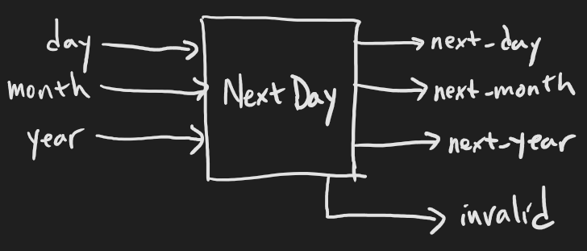

# Exercise 2: The day after

<div style="text-align: right">The 14th of January is World Logic Day.</div>


## What you'll do:

Create a module that takes as inputs a date, consisting of:

* The Anno Domini year (1-9999)
* The month number (1-12)
* The day number (1-31)

And outputs the day number, month number, and year for the following day. If the inputs aren't a valid date in this range, output all zeros and raise an "invalid" signal. Don't bother with the Julian/Gregorian changeover, just assume that all days are in the Gregorian calendar. The technical term for Gregorian dates during the Julian calendar is "proleptic Gregorian".



A leap year occurs if the year is divisible by four, unless the year is divisible by 100. But if the year is divisible by 400, it's a leap year. For example, 1900 was not a leap year, but 2000 was.

The number of days in the month goes according to this table:

| Month number | Days in month |
|--------------|---------------|
| 1 | 31 |
| 2 | 28, or 29 in a leap year |
| 3 | 31 |
| 4 | 30 |
| 5 | 31 |
| 6 | 30 |
| 7 | 31 |
| 8 | 31 |
| 9 | 30 |
| 10 | 31 |
| 11 | 30 |
| 12 | 31 |

You will also formally verify that:

* An all zero numeric output always happens with invalid.
* Either all numeric outputs are zero, or no numeric outputs are.
* The day after 31 in a valid date is always 1.
* The month after 31 Dec in a valid date is always 1.
* 29 Feb in an odd year is always invalid.
* What inputs can lead to an output date of 29 Feb?

### More about if-else

In the previous exercise we discussed `with m.If` and `with m.Else`. You can also add `with m.Elif` to the mix:

```python
with m.If(x == 10):
  m.d.comb += z.eq(50)
with m.Elif((x == 11) | (x == 13)):
  m.d.comb += z.eq(40)
with m.Elif(x == 12):
  m.d.comb += z.eq(30)
with m.Else():
  m.d.comb += z.eq(0)
```

### The switch-case

The switch-case compares a given signal to any number of cases. It's equivalent to a whole if-else chain, but is sometimes more convenient. This is the equivalent of the example above:

```python
with m.Switch(x):
  with m.Case(10):
    m.d.comb += z.eq(50)
  with m.Case(11, 13):
    m.d.comb += z.eq(40)
  with m.Case(12):
    m.d.comb += z.eq(30)
  with m.Default():
    m.d.comb += z.eq(0)  # If no case matches
```

### Specifying the range of a signal

You don't always have to figure out the number of bits a signal needs. You can specify its range using Python's `range` like so:

```python
x = Signal(range(stop))
y = Signal(range(start, stop))
```

This means that the signal will have as many bits as it takes to represent any integer between start (inclusive) and stop (exclusive). Excluding the stop value is consistent with the way `range` works in Python. So, a signal defined by `Signal(range(1, 8))` would be 3 bits wide, to represent all the integers between 1 and 7 (inclusive).

Note that this doesn't perform any kind of check on the values you assign to the signal. A signal "starting" from 1 can still be assigned 0.

### This signal is like that signal

If you want a signal to have the same shape as an existing signal, then you can use `like`:

```python
x = Signal(range(1, 10))
y = Signal.like(x)
```

With this, `y` will have the same shape as `x`.

## Your turn

As before, you will need to:

* Start from `skeleton.py`.
* Define your inputs and outputs.
* Write the logic for the module in `elaborate`.
* Write your asserts in `formal`.
* Make sure it compiles with `python3 your_file.py gen`.
* Run formal verification in cover mode using `sby -f answers/e02_next_day.sby cover`.
* Run formal verification in BMC mode using `sby -f answers/e02_next_day.sby bmc`.

If you want, you can run all formal verification modes by leaving off the mode: `sby -f answers/e02_next_day.sby`. This actually runs all the things specified in the `[tasks]` section in the sby file.

## Stumped?

The answer to this exercise is in [`answers/e02_next_day.py`](answers/e02_next_day.py).
