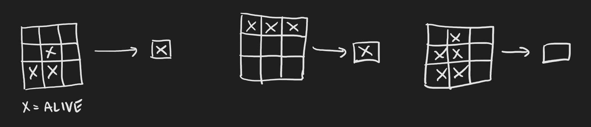
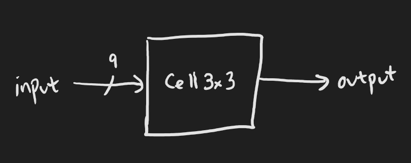
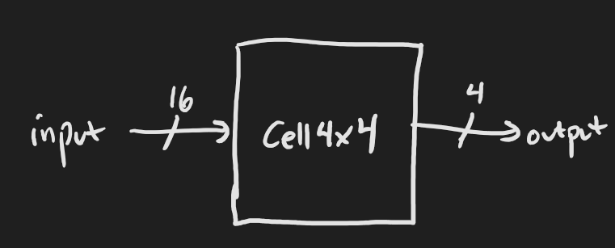

# Exercise 3: Life finds a way

## What you'll do, part 1:

Create a module that determines the state of a cell in the Game of Life. It takes as input:

* A 9-bit signal encoding the a 3x3 area, where a 0 is a dead cell and a 1 is a live cell.

The positions of the cells are encoded with bit positions as follows:

|  | -1 | 0 | +1 |
|--:|----|---|----|
| -1: | 0 | 1 | 2 |
| 0:  | 3 | 4 | 5 |
| +1: | 6 | 7 | 8 |

Bit position 4 is the "middle cell", while the other bit positions are its neighbors.

The output is a 1 if the middle cell becomes live, or 0 if the middle cell becomes dead. The rules are:

* If the middle cell is alive, and has exactly 2 or 3 live neighbors, it stays alive.
* If the middle cell is dead, and has exactly 3 live neighbors, it becomes alive.
* Otherwise, the middle cell becomes dead.



Formally verify that:

* If the middle cell, dead or alive, has exactly 3 live neighbors, it becomes alive.
* If the middle cell has exactly 2 live neighbors, it retains its state.



### Bit positions

You can extract sequential bits from a signal using Python's slice notation:

```python
x = Signal(16)
y = x[0]    # Extracts the least significant bit
z = x[-1]   # Extracts the most significant bit
a = x[1:4]  # a extracts bits 1, 2, and 3 of x.
```

Some tricks you can play:

```python
x = Signal(16)
b = x[:8]    # b extracts the least significant eight bits of x (i.e. bits 0-7).
c = x[8:]    # c extracts the most significant eight bits of x (i.e. bits 8-15).
y = x[::-1]  # y extracts the bits of x in reverse.
z = x[::2]   # z extracts every other bit of x.
```

All of the above are expressions, and you can use them in other expressions:

```python
x = Signal(16)
with m.If(x[0]):
    # x is odd
with m.Else():
    # x is even
```

```python
x = Signal(16)
with m.Switch(x[:2]):
    with m.Case(0):
        # x % 4 == 0
    with m.Case(1):
        # x % 4 == 1
    with m.Case(2):
        # x % 4 == 2
    with m.Case(3):
        # x % 4 == 3
```

```python
x = Signal(16)
y = x[:3] + 3
```

You can also assign bit positions in a signal. For example, this could implement a left rotate:

```python
x = Signal(16)
y = Signal(16)

m.d.comb += y[0].eq(x[-1])
m.d.comb += y[1:].eq(x)
```

Here's a left shift into a carry bit:

```python
x = Signal(16)
y = Signal(16)
c = Signal()

m.d.comb += c.eq(x[-1])
m.d.comb += y[0].eq(0)   # Or equivalently:
m.d.comb += y[1:].eq(x)  #   y.eq(x << 1)
```

## What you'll do, part 2:

Create a 4x4 module (so it has a 16-bit input) that outputs the middle 4 cells for the next time step. Use copies of your 3x3 module to achieve this.

Cover the case where the middle four cells don't change state, and at least one of the cells ends up alive.

Also, prove that if the outputs are all ones, and the four middle inputs are all ones, then all the other inputs must be zero.



### Submodules

As in the `formal` function, you can add submodules to a module:

```python
m = Module()
m.submodules.my_submodule = my_submodule = MySubmodule()
m.submodules.another_submodule = another_submodule = AnotherSubmodule()
```

Then you can hook up their inputs and outputs:

```python
m.d.comb += another_submodule.input0.eq(my_submodule.output1)
```

### A whole bunch of submodules!

You don't have to add submodules to `m.submodules` one at a time. You can add an array of submodules:

```python
m = Module()
a = MySubmodule1()
b = MySubmodule2()
c = MySubmodule3()
m.submodules += [a, b, c]
```

### A whole bunch of statments!

You don't have to add statements to `m.d.comb` one at a time. You can add an array of statements:

```python
m.d.comb += [
    x.eq(2),
    another_submodule.input3.eq(y << 4),
    z.eq(my_submodule.output2),
]
```

## Stumped?

The answers are in [`answers/e03_cell3x3.py`](answers/e03_cell3x3.py) and [`answers/e03_cell4x4.py`](answers/e03_cell4x4.py)