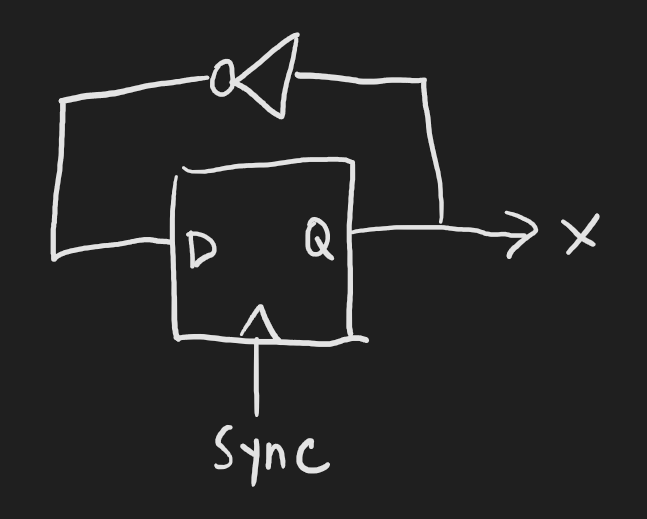
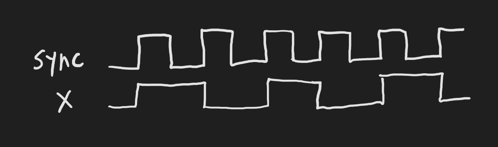
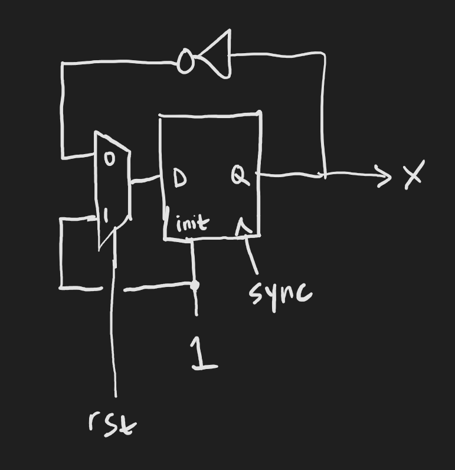
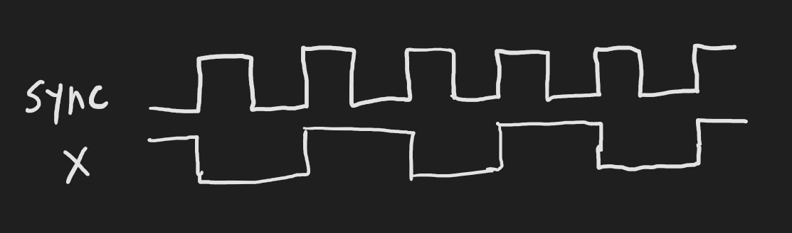
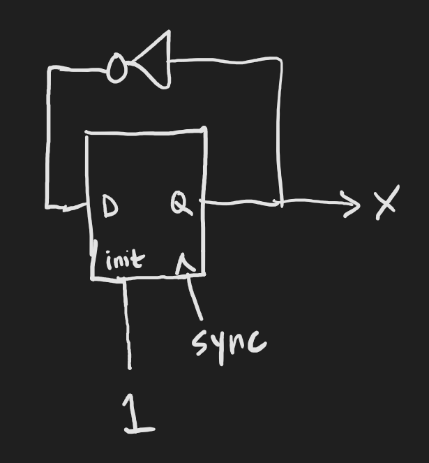
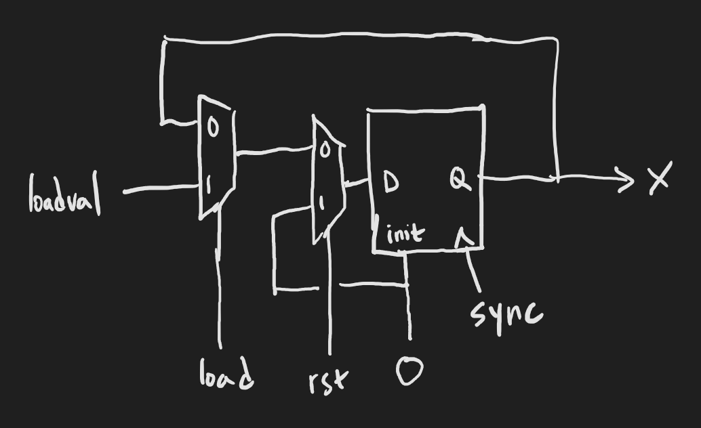
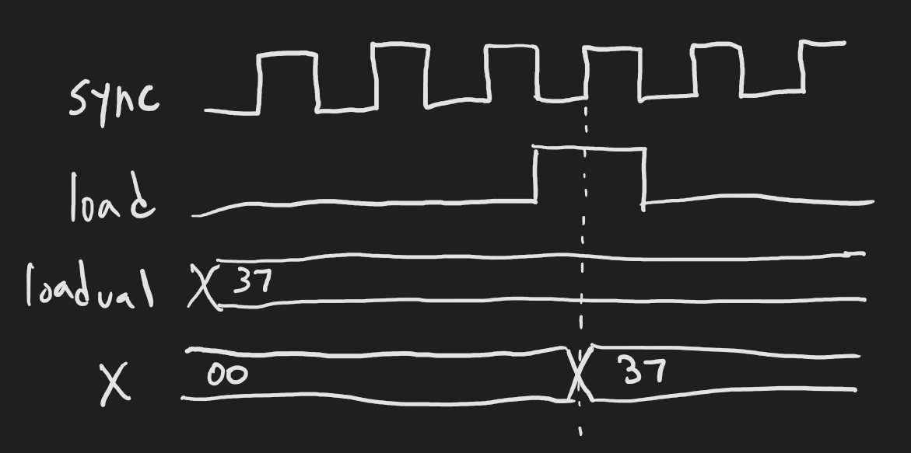

# Exercise 5: Synchronicity

<p align="right">
A connecting principle, linked to the invisible...
</p>

------
## What you'll do:

Create a module that counts from 1 to 9 and back to 1 again. Formally verify that the output can never be greater than 9 and can never be 0. Cover the case where the output is 3.

## Synchronous domains

Unlike combinatorial domains, synchronous domains are associated with a clock signal and a reset signal. Assignments that are added to a synchronous domain take place on one of its clock's edge, the positive edge by default.

The `sync` domain is the default domain that is always present:

```python
x = Signal()
m.d.sync += x.eq(~x)
```

The above will flip `x` on every positive edge of the sync clock.




You can only drive a signal from one domain. This would result in a driver-driver conflict:

```python
x = Signal()
m.d.sync += x.eq(~x)
m.d.comb += x.eq(0)
```

## Synchronous resets

A signal driven from a synchronous domain gets reset when that domain's reset signal goes high and the clock's edge happens, or on circuit initialization. The reset value of the signal is set by the `reset` key when creating the signal, and defaults to 0:

```python
x = Signal(reset=1)
m.d.sync += x.eq(~x)
```




You can prevent the signal from getting reset, except on circuit initialization, by using the key `reset_less`:

```python
x = Signal(reset=1, reset_less=True)
m.d.sync += x.eq(~x)
```



## Synchronous signals are registers

If a synchronous signal isn't assigned on an edge, it retains its value.

```python
x = Signal(8)
load = Signal()
loadval = Signal(8)

with m.If(load):
  m.d.sync += x.eq(loadval)
```

For the above, only if `load` is high will `x` be loaded with `loadval` on the sync clock edge.




You can think of the domain's reset signal as loading all registers in that domain with their reset values (unless they're `reset_less`).

## Bounded model checking

Up until now, we've been using bounded model checking to assert on combinatorial logic. However, with sequential logic, signals can change with time. So, bounded model checking specifies the number of time steps to take after the initial reset. This is specified in the `[options]` section of the sby file, as the value of `depth`. That's why it's called "bounded model checking", because it checks your model only up to the depth you specify.

This means that you will have to know how long to run your verification before you can be sure all your asserts are checked. Later we will see a more powerful technique (induction) which doesn't have such a painful requirement.

What exactly is "a time step"? It's a change in a clock signal. So, a full cycle of the sync clock would be two time steps.

-----

This is only true if the `multiclock` parameter in `[options]` is set to `on`. Unless you really really know what you're doing, leave it set to `on`.

-----

## The domain for Asserts and Covers

Unless you really really know what you're doing, keep asserts and covers in the combinatorial domain. The asserts will be checked on every time step.

## Your turn

You can use the [answers/e05_counter.sby](answers/e05_counter.sby) file to run your formal verification. It is set up for 22 time steps, or 11 cycles of the clock. This should be enough to have the counter cycle around once.
