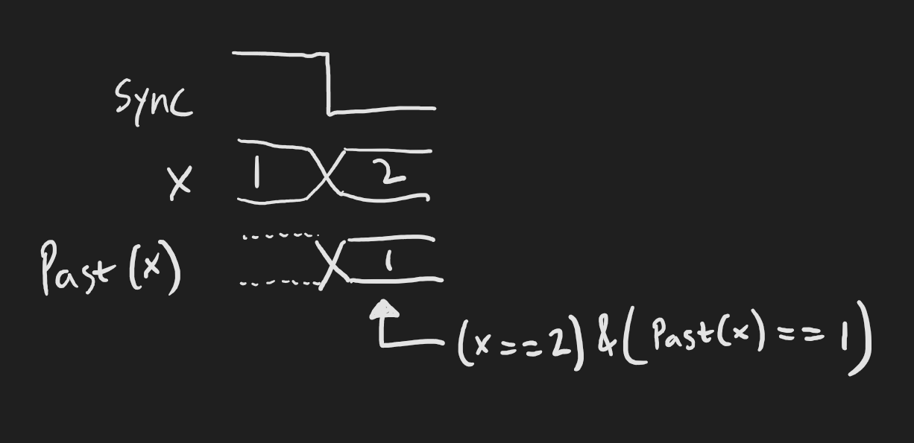
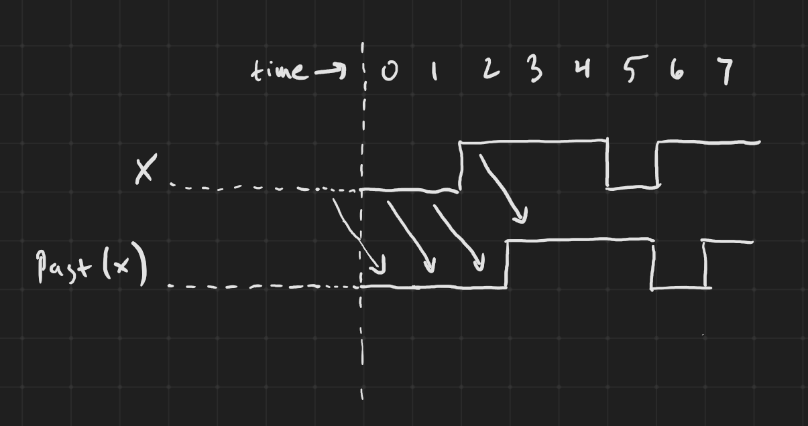
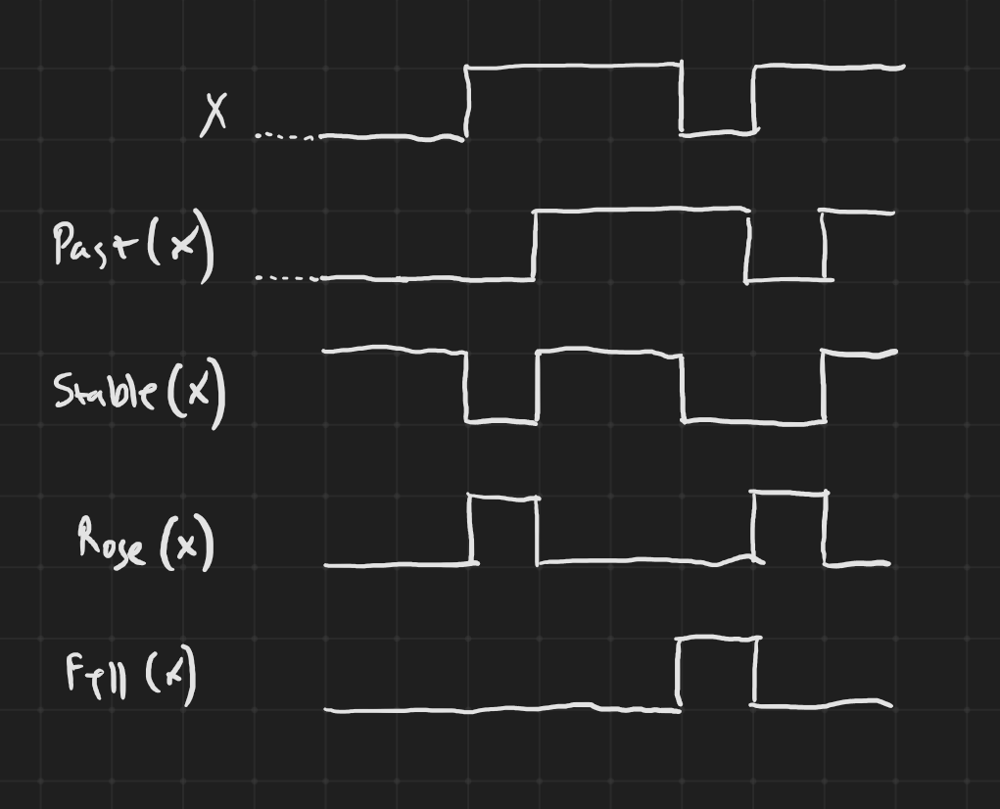
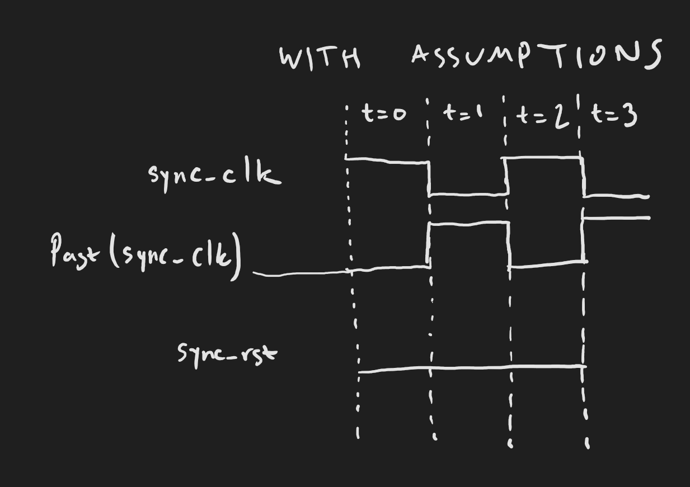
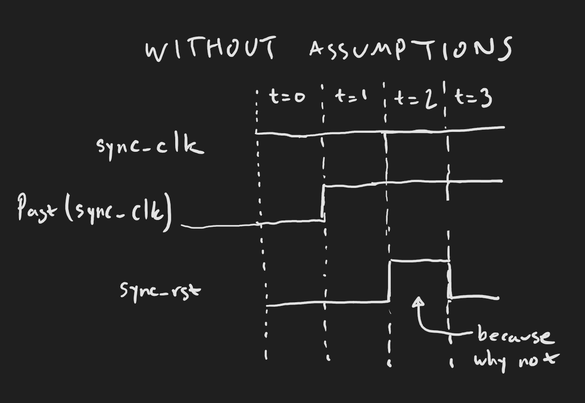

# Exercise 6: Living in the past

## What you'll do:

In the previous exercise, you showed that the output of a counter that counted from 1 to 9, going back to 1, was never 0 and was never greater than 9. You also covered the case where the output was 3. Hopefully you saw that the output started at 1, went to 2, and then to 3.

Show that each positive edge of the clock increments the counter by one, and that the counter goes from 9 back to 1.

## The Past

In formal verification, you can refer to the value of a signal as it was one time step ago by using `Past`:

```python
from nmigen.asserts import Past

m.d.comb += Assert((x == 2) & (Past(x) == 1))
```

The above asserts that `x` is now 2, but one time step ago it was 1.



We can also look at the value of a signal N steps ago by giving `clocks=N` to `Past`:

```python
m.d.comb += Assert((x == 2) & (Past(x, clocks=2) == 1))
```

The above asserts that `x` is now 2, but two time steps ago it was 1. The default for `clocks` is 1.


What is the value of `Past` before the very first time step? It is the reset value of the signal.



## The clock and reset signals

So far you haven't used the clock or reset signals in anything. But you can access them using `ClockSignal("domain-name")` and `ResetSignal("domain-name")`.

```python
from nmigen import ClockSignal, ResetSignal

sync = ClockSignal("sync")
with m.If(sync):
    m.d.comb += Assert(x == 2)
```

The above checks that `x` is always 2 when the `sync` clock is high, but makes no assertion about what `x` is when the `sync` clock is low.

## Other past-looking functions

```python
from nmigen.asserts import Stable, Rose, Fell
```

`Stable(x)` is equivalent to `x == Past(x)`.

`Rose(x)` is equivalent to `(x == 1) & (Past(x) == 0)`.

`Fell(x)` is equivalent to `(x == 0) & (Past(x) == 1)`.

`Stable(x, clocks=N)`, `Rose(x, clocks=N)`, and `Fell(x, clocks=N)` are equivalent to using `clocks=N+1` in the `Past` expression, so the default `clocks` value is 0.



## Initial

The `Initial()` signal is 1 when we are on the very first time step, and 0 otherwise. This is useful for determining whether `Past` is going to give you the reset value.

```python
from nmigen.asserts import Initial
```

## Assumptions

There's a hidden assumption that you're making when you ask the formal verification engine to verify a circuit with clocks in it: that the clocks actually clock.

Earlier we said that there is a built-in clock domain, `sync`. However, you still need to explain to the engine how that input signal (for it is an input signal to your circuit) is supposed to operate. We do that with assumptions.

Assumptions force the verification engine to ensure that the assumptions are true. So for example, suppose `x` were an input to some module that you want to verify:

```python
from nmigen.asserts import Assume

x = Signal(16)  # An input signal
m.d.comb += Assume(x < 0xD000)
```

The above would force the engine not to consider cases where `x >= 0xD000`. As a less direct assumption:

```python
x = Signal(4)  # An input signal
y = Signal(4)  # Another input signal
z = Signal(4)
m.d.comb += z.eq(x + y)
m.d.comb += Assume(z < 10)
```

Now the engine can only consider `x` and `y` such that `x + y < 10`. By the way, this is where the prover's built-in theories can really help. With a theory of linear arithmetic built in, the Z3 solver is able to short-cut a brute-force solution to the equation.

The fun continues when you have complex circuits with signals that indicate complex conditions. You can simply assume that such a signal goes high, and the solver will be forced to make that complex condition happen.

This may sound similar to the Cover statement, but covering only tries to find one path to making the condition happen. Assumption works with bounded model checking (and later, induction) to find all such paths.

## Assuming a clock

So, because we need to assume that the `sync` clock actually clocks, we add this to the `formal` function in our skeleton code (see [`skeleton_sync.py`](skeleton_sync.py)):

```python
...

sync_clk = ClockSignal("sync")
sync_rst = ResetSignal("sync")

# Make sure the clock is clocking
m.d.comb += Assume(sync_clk == ~Past(sync_clk))

# Include this only if you don't want to test resets
m.d.comb += Assume(~sync_rst)

# Ensure sync's clock and reset signals are manipulable.
return m, [sync_clk, sync_rst, my_class.my_input]
```

Without this assumption, formal verification can feel free to simply not clock `sync`, and then your counter will be stuck at its initial value.




## Bad assumptions

Sometimes you might get too clever and write some assumptions that can't all simultaneously work. For example, consider the assumption that `sync_clk == ~Past(sync_clk)`. Remember we said that the `Past` of any signal before the initial time step is its reset value? The reset value for clocks is `0`. Therefore, at the first time step, `Past(sync_clk)` is `0` and so `~Past(sync_clk)` is `1`. And because of our assumption, `sync_clk` on the first time step will be `1`.

However, if you wanted to force the clock to be `0` on the first time step using an assumption:

```python
with m.If(Initial()):
    m.d.comb += Assume(~sync_clk)
```

Now you have two contradictory assumptions. One says that the clock must be the opposite of its past value, the past value on the first step is 0, so the clock must be 1 on the first step.

The other assumption says that the clock must be 0 on the first step.

If you run into contradictory assumptions, formal verification will give you a message like this:

```
SBY 10:42:59 [e06_counter_bmc] engine_0: ##   0:00:00  Assumptions are unsatisfiable!
SBY 10:42:59 [e06_counter_bmc] engine_0: ##   0:00:00  Status: PREUNSAT
```

## Your turn

Armed with all the above, you should now be able to construct your assumptions and assertions to meet the problem posed at the beginning of this exercise. Remember that sequential positive edges on the `sync` clock are two time steps apart!

## Stumped?

The answer to this exercise is in [`answers/e06_counter.py`](answers/e06_counter.py).
