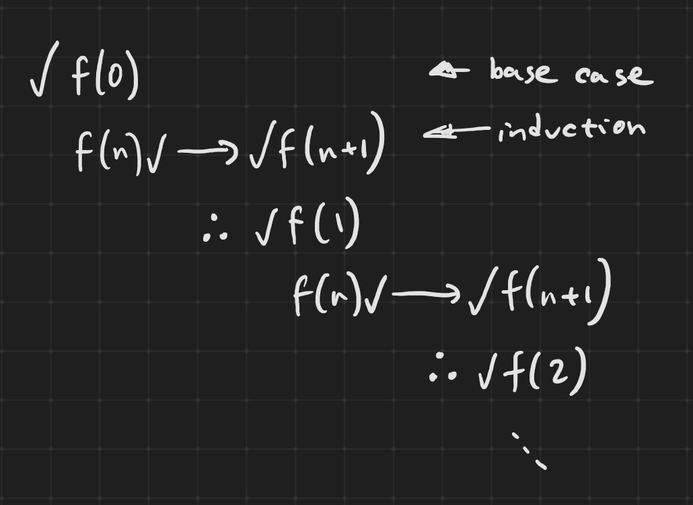
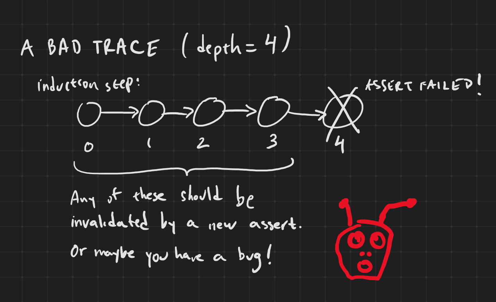

# Exercise 7: Prove it!

## What you'll do:

Change your counter so that instead of going from 1 to 9, it goes from 1 to 999,999,999,999 and then to 1 again.

Use prove mode instead of bmc mode to show that your counter still does what it is supposed to.

## Proof by induction

Bounded model checking is nice, but requires you to run the circuit for as many time steps as necessary to hit all states. Clearly for a 40-bit counter like the above, it just doesn't make sense to run bounded model checking for a trillion steps.

Instead, we rely on proof by induction, which is a mathematical technique used to prove that something works for *any* number of steps.

Suppose we had some function, call it `f`, that takes an integer parameter `k`. Let's suppose the function outputs true or false, and we want to show that `f(k)` is true for every value of `k` starting with, say, 0. To do this, we first show that `f(0)` is true. This is called the *base case*. Then we show that *if we assume* that `f(n)` is true for some `n`, *then* `f(n+1)` is also true. This is called the *induction step*.

Notice that we don't have to prove that `f(n)` is true, just assume it is, and based on that see if `f(n+1)` is true.

So if we can show that the base case is true, and that the inductive step is true, we can conclude that logically, every `f(k)`, no matter what `k` is, is true (for `k >= 0`).



## Formal verification by induction

In formal verification, we can use induction, but only if we carefully craft the base case and induction step:

The base case: Bounded model checking for N steps passes.

The inductive step: Starting from any valid state, proceeding for N+1 steps passes.

The `N` mentioned above is the `depth` parameter in the `[options]` section of sby file. And, instead of specifying `bmc` as the `mode` in `[options]` and in `[engines]`, we specify `prove` to perform verification by induction.

Formal verification by induction is a powerful technique. However, in complex circuits the state space might be too large to fully assert on, so you may need to do many rounds of debugging to find out why the inductive step found a series of N valid states followed by an invalid (i.e. assertion-breaking) state. Most likely you just need to figure out whether the first state it chose (or any of the states along the path) is valid, and if not, eliminate it with another assert.



But once you've done that, you'll know that from its initial state, your circuit will not break any assert for *any* number of time steps.

## Your turn

Use the supplied [`answers/e07_counter.sby`](answers/e07_counter.sby) file and run it in prove mode:

```
sby -f answers/e07_counter.sby prove
```

The depth has been kept at 22 like before. But, you can reduce that to as little as 2 steps, which covers one positive edge of the clock, and therefore any transition of the counter. Of course, if you have cover statements, you may need to increase the depth.

# Stumped?

Well, there shouldn't be any change except to your counter logic, and using prove mode. But if you need it, the answer is in [`answers/e07_counter.py`](answers/e07_counter.py)
